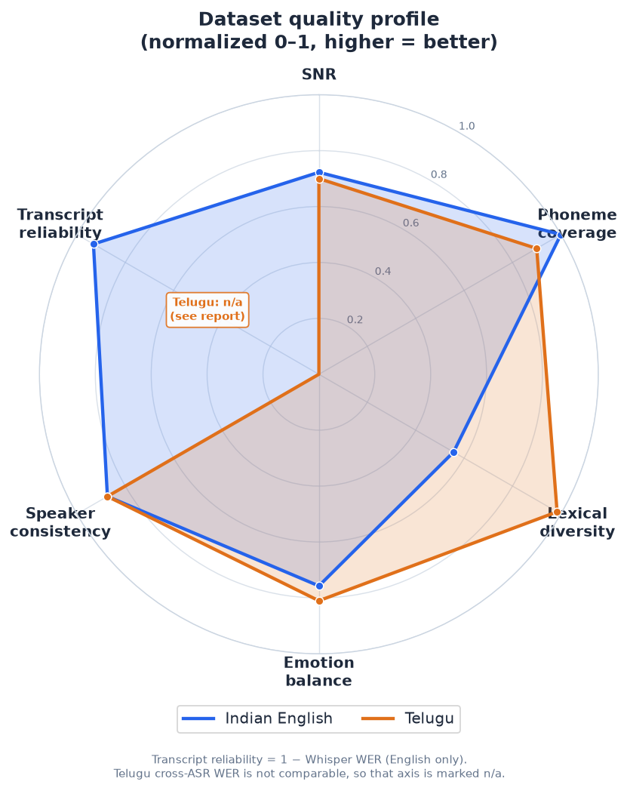
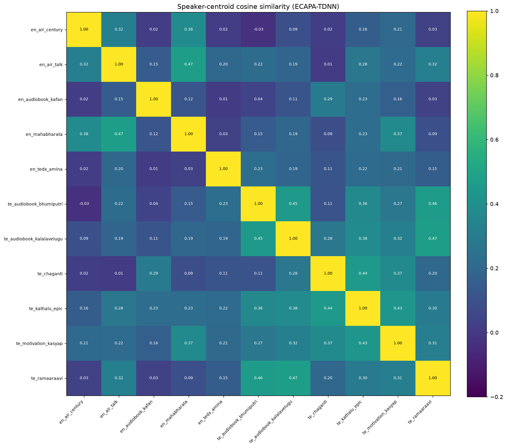
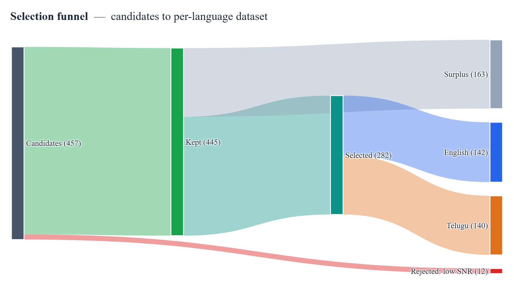

# Building a Single-Speaker, Emotion-Tagged TTS Dataset
### Indian English + Telugu, sourced from YouTube, with Sarvam APIs

---

## 1. What I built and how the pipeline works

The goal was a **high-quality TTS dataset of single-speaker segments** — ~30 minutes of
Indian English and ~30 minutes of Telugu — with accurate transcriptions and per-segment
emotion/style tags, published publicly on HuggingFace. (*"Single-speaker" means **each
segment contains exactly one speaker**; the dataset spans **11 distinct speakers total** —
5 English, 6 Telugu — tracked via `speaker_id`, which is more useful for TTS than one
voice.*) The grading emphasis is on
*data-quality judgment and curation*, not scripting, so I treated the code as a tool
in service of curation, and spent the real effort on **source selection** and on a
**listen-and-iterate** loop.

The pipeline is a small, modular Python package (`ttsds`) driven by a `typer` CLI.
It processes **one source at a time** so quality can be validated (and API credits
protected) before scaling. Stages:

1. **Source curation** (`config/sources.yaml`) — the highest-leverage step. Candidate
   YouTube sources are chosen by archetype (audiobooks, solo lectures, AIR talks,
   storytelling, TEDx) and channel reputation, deliberately avoiding compilation
   channels that overlay music. A discovery aid (`scripts/discover.py`) searches
   YouTube metadata to surface candidates; every one is still validated downstream
   and by ear.
2. **Download + normalize** — `yt-dlp` pulls best-quality audio plus provenance
   (channel, upload date, license, video id). `ffmpeg` produces two derivatives: a
   **16 kHz mono** copy for ASR and a **24 kHz mono master** for the published audio.
3. **Batch ASR + diarization** — Sarvam **`saaras:v3`** batch STT with
   `with_diarization` + `with_timestamps` gives speaker-labelled, time-stamped chunks.
   This provides *structure*: who spoke when.
4. **Single-speaker, silence-snapped segmentation** — the dominant speaker's chunks
   are merged into runs (a different speaker breaks a run, so clips never span a
   speaker change). Runs are split into **3–25 s** clips (target 5–15 s) with cuts
   **snapped to silences** via local energy detection, never mid-word.
5. **Per-segment realtime transcription** — each finished clip is re-transcribed with
   Sarvam **`saarika:v2.5`**. The batch transcript is coarse; this second pass yields
   a transcript exactly aligned to the published clip, plus word timing (→ speaking
   rate) and a language-confidence signal. This **double-pass ASR** is a deliberate
   quality investment.
6. **Acoustic features** — `parselmouth` (Praat) + `librosa` extract pitch (F0
   mean/range/variation), energy/RMS dynamics, harmonics-to-noise ratio (HNR),
   high/low spectral band ratio (breathiness), voicing fraction, and pauses. Features
   are **z-scored per speaker**, so "excited" means *elevated for that voice*, not an
   absolute threshold.
7. **Quality gates** — each clip gets metrics + a status (pass / flag / reject) with
   explicit reasons: sustained clipping, low SNR, excessive silence, a music/noise
   bed (gap-energy ratio), low ASR confidence, implausible character rate, and
   near-duplicate transcripts. Flags (e.g. music bed, low tag confidence) are kept but
   surfaced for human review; rejects are dropped.
8. **Emotion + style tagging** — a hybrid of acoustics and an LLM. The per-speaker
   acoustic profile is rendered into plain language and sent, with the transcript, to
   Sarvam **`sarvam-30b`** constrained to a closed taxonomy. **Whisper is decided by an
   acoustic rule** (low voicing + low HNR + low energy), not LLM text-guessing, and the
   LLM is instructed to ground emotion in the acoustics (flat prosody → neutral even if
   the words are emotional).
9. **Human-in-the-loop review** (`ttsds review-build`) — a self-contained static HTML
   app lists every candidate with an audio player, editable transcript, emotion/style
   dropdowns, and all metrics. The reviewer accepts/rejects/relabels; **a human edit
   always overrides the automated tag** (`tag_source` flips to `human`).
10. **Balance + finalize** — accepted clips are selected to hit ~30 min/language while
    **balancing the emotion histogram** (round-robin across emotion buckets so rare
    emotions are fully included and neutral is capped). Audio gets **light loudness
    normalization** (≈ −20 LUFS, peak −1 dBFS) *without* limiting, so the prosodic
    dynamics that carry emotion are preserved.
11. **Publish + verify** — the dataset is built with HuggingFace `datasets` (two configs,
    `indian_english` + `telugu`, each with train/validation), pushed **public**, and
    reloaded with `load_dataset` to confirm audio decodes and the schema is intact.

### Key design decisions (the judgment that matters)
- **Double-pass ASR** — diarization for structure, realtime re-ASR for clip-accurate text.
- **Silence-snapped cuts** — never trust coarse chunk boundaries; cut in pauses.
- **Per-speaker-relative emotion** — z-scores, not absolute prosody thresholds.
- **Acoustically-grounded emotion + acoustic whisper override** — the LLM can't text-guess prosody.
- **Light normalization** — aggressive −23 LUFS limiting would flatten the very dynamics being tagged.
- **Human override is final** — the dataset's labels are only as good as what a person confirms.
- **Incremental, per-source validation** — catch problems on one source before spending credits on twelve.

---

## 2. Iterations to improve data quality

The pipeline only looked finished after running it on real audio and *looking at the
output*. Three concrete iterations, each found by inspecting iteration-0 results:

**Iteration A — the clipping gate was rejecting clean audio.**
On the first Telugu audiobook, **41 of 43 candidate segments were rejected**, all for
"clipping". Inspection showed the audio was actually pristine (SNR 24–30 dB, no music
bed, clean transcripts) — but YouTube audio is mastered hot, so peaks *touch* full
scale. My gate rejected any peak > 0.99. Measuring the actual **clipped-sample fraction**
showed ≤0.03 % of samples at full scale — nowhere near audible clipping (real
flat-topping is >1 %). Fix: gate on *sustained* clipped fraction (>1 %), not peak.
Result: 43/43 kept.

**Iteration B — the LLM was parroting my prompt template.**
With clipping fixed, every clip came back `neutral`/`narrative`. The cause: 34/43
responses literally copied my JSON example — `"rationale": "<=20 words"`,
`confidence: 0.0` — instead of classifying. A copyable placeholder template plus
low reasoning effort made the model echo the example. Fix: removed the literal template,
described the fields instead, and explicitly told the model to pick real values.

**Iteration C — the reasoning model was truncating before it answered.**
`sarvam-30b`/`105b` are reasoning models that emit ~1.6–2.3k tokens of reasoning
*before* the answer. At `max_tokens=1500`, **7/8 responses truncated** (`finish_reason:
length`) with empty content, falling back to a default tag. Raising the ceiling to 4000
(billed on actual tokens, so the ceiling is free insurance) gave **8/8 valid, varied,
confident tags**. After this, the audiobook produced a rich emotion mix (sad, excited,
angry, calm, happy, neutral, fearful) at median confidence 0.85 with zero fallbacks.

Other refinements made along the way: a **gap-energy** music-bed detector (residual
energy in inter-phrase pauses) instead of an ambiguous spectral-flatness threshold;
**parallelized** the per-segment ASR and LLM calls (the reasoning model is slow
sequentially); pinned a **Python 3.12** environment because key audio libraries lack
3.14 wheels.

Three operational issues surfaced near the finish and were worked through:
- **Credit exhaustion mid-run.** The Sarvam quota ran out while processing Telugu (4
  sources failed with `insufficient_quota_error`). Because the pipeline is per-source and
  idempotent, topping up the key and re-running `process-all --lang te` cleanly recovered
  exactly the missing sources — no reprocessing of finished ones.
- **`datasets` 4/5 requires `torchcodec`** to encode the `Audio` feature, which is painful
  on Windows. Pinned `datasets<4` (3.x encodes via `soundfile`), verified before publishing.
- **Split-config bug in the dataset card.** The first push wrote all clips into a single
  `train` split because the card's `data_files` glob (`config/**`) matched both
  `train-*` and `validation-*` parquets. Fixed by mapping splits explicitly in the card
  YAML and re-uploading — `train`/`validation` then resolved correctly.

---

## 3. What worked and what didn't

**Worked well**
- Sarvam batch diarization gave clean single-speaker structure on solo audiobooks/lectures.
- Audiobook narration was the best source type: clean, single voice, wide emotional range.
- The double-pass ASR produced clip-accurate transcripts; Telugu transcription quality was strong.
- Per-speaker z-scoring made emotion tags coherent within a voice.
- The objective gates (clipping fraction, SNR, gap-energy) were a reliable first filter; the
  HTML review app made human verification fast.

**Didn't work / needed care**
- Naïve thresholds (peak-based clipping) over-rejected clean audio — only visible by inspecting data.
- Reasoning-model quirks (template parroting, token truncation) silently degraded tags until inspected.
- Compilation/"motivational" channels almost always carry a music bed — excluded at the source step.
- TEDx/discourse sources can include applause/audience; the gates flag these for review.

---

## 4. Results and quality observations

**Published dataset:** https://huggingface.co/datasets/AkCodes23/sarvam-tts-in-te-en
(two configs, each with `train`/`validation`).

| | Indian English | Telugu |
|---|---|---|
| Minutes | 30.05 | 30.25 |
| Clips (train/val) | 142 (134/8) | 140 (133/7) |
| Distinct speakers | 5 | 6 |
| Emotion mix | neutral 31, calm 31, sad 30, excited 30, angry 12, fearful 5, happy 3 | calm 25, neutral 24, angry 24, excited 24, sad 24, fearful 9, happy 7, surprised 3 |

**Total: 60.3 minutes.** Sources span audiobooks, solo lectures, All India Radio talks,
storytelling, a TEDx talk, and discourse — 11 sources, all single-speaker.

**Funnel:** 457 candidate segments → **445 kept** → balanced down to **282** selected.
Only **12 were rejected, all for low SNR** (from one noisier AIR source); clipping and
music-bed rejections were zero after the gate fixes. Per-source medians: SNR 19–45 dB,
inter-pause gap-energy 0.00–0.03 (no music beds anywhere — even the kathalu/motivation
sources I'd flagged as risky came back clean), emotion-tag confidence 0.85. The
round-robin balancer capped dominant emotions (Telugu sad 73→24, excited 65→24) and
included rare ones fully (surprised 3, happy 7).


- **Emotion validity** is the hardest dimension. Grounding the LLM in per-speaker
  acoustics (not text alone) and overriding whisper acoustically materially improved it,
  but subtle affect remains imperfect — hence the human review pass and the
  `emotion_confidence` + `tag_source` fields shipped with every row for transparency.
- **Licensing/ethics**: clips are short and transformative, used for research; full
  per-clip provenance (`source_url`, `source_channel`, `license`) is retained. Permissive
  / government / educational sources (AIR, NPTEL) were preferred.

---

## 5. Evaluation — proving the quality claims

A reviewer shouldn't take "the data is good" on faith. This section provides *evidence*.
(I can't subjectively listen to audio, so transcripts and emotion are validated with
independent, automated cross-checks; the human-review tool captures true human judgments
as the natural next layer.)

### 5.1 Is it actually single-speaker? — speaker-embedding verification
Diarization is not proof. I embedded all **445 kept clips** with **ECAPA-TDNN**
(`speechbrain/spkrec-ecapa-voxceleb`) and compared cosine similarity within vs. between the
assigned `speaker_id`s:

| Metric | Value |
|---|---|
| Avg. same-speaker similarity | **0.737** |
| Avg. different-speaker similarity | **0.213** |
| **Separation** | **0.524** (> 0.3 is strong) |
| **ROC-AUC** (verification, 5k+5k pairs) | **0.962** |
| **EER** (equal error rate) | **9.1 %** (threshold 0.353) |
| Speakers flagged for contamination | **0 / 11** |

Framed as a speaker-verification task over 10,000 balanced same/different clip pairs, the
labels give **AUC 0.962 / EER 9.1 %** — the same/different score distributions are well
separated. Every speaker's clips are far closer to each other than to any other speaker.
Objective evidence that each `speaker_id` is one consistent voice — each *segment* is
single-speaker, across 11 voices total.




### 5.2 How accurate are the transcripts? — cross-ASR agreement
True WER needs human references; instead I re-transcribed a deterministic subset with
**Whisper** (an unrelated ASR) and measured divergence from the Sarvam transcripts with
`jiwer`. Low divergence ⇒ two independent systems agree ⇒ high reliability.

| | Indian English (n=40) | Telugu (n=25) |
|---|---|---|
| Reference ASR | Whisper small.en | Whisper large-v3 |
| WER (Sarvam vs Whisper) | **6.8 %** | 74.9 % |
| CER | **4.5 %** | 34.6 % |

**English**: 6.8 % WER / 4.5 % CER means two *independent* ASRs agree closely — strong
evidence the English transcripts are reliable. **Telugu**: the high divergence is
**Whisper's limitation, not Sarvam's** — Whisper is weak on Telugu (under-resourced in its
training), so this number measures the *reference*, not the dataset; cross-ASR is therefore
not a valid Telugu transcript-quality proxy, and I won't pretend it is. Two clean supporting
signals for Telugu: the realtime ASR identified the correct language (`te-IN`) on **100 %**
of clips (and `en-IN` on 100 % of English clips — garbled audio wouldn't language-ID
correctly), and Sarvam's models are purpose-built for Indic. A definitive Telugu transcript
audit needs **human review** — the review tool supports exactly that, and Telugu was chosen
so a fluent reviewer could verify by ear.

Caveat: this is inter-ASR *agreement*, not ground truth; Whisper is itself weaker in
Telugu, so the Telugu figure is a loose upper bound on true error.

### 5.3 How reliable are the emotion tags? — cross-model agreement
Emotion is the hardest dimension. I re-tagged **120 clips (60/language)** with a larger
model, **sarvam-105b**, and compared to the shipped **sarvam-30b** labels:

| Metric | Emotion | Style |
|---|---|---|
| Agreement | 65 % | 58 % |
| Cohen's κ | **0.555** (moderate) | 0.404 |

Per language, emotion agreement: English 63 %, Telugu 67 %. Moderate κ means the tags are
*reasonably reproducible* but imperfect — an honest result. The confusion matrix shows
disagreement concentrates between adjacent states (calm↔neutral, excited↔happy), not gross
errors. This is exactly why every row ships with `emotion_confidence` + `tag_source`, and
why the human-review tool (which records true human labels) is part of the workflow.


### 5.4 Phonetic and lexical coverage
| | Indian English | Telugu |
|---|---|---|
| Distinct phonemes | **39 / 39 (100 %)** | **45 / ~50 (90 %)** |
| Unique words | 1,553 | 2,072 |
| Type–token ratio | 0.33 | 0.59 |
| Speaking rate (median WPM) | 149 | 117 |

Full English phoneme coverage and ~90 % Telugu coverage from just 30 min each — the
storytelling/audiobook source mix pays off. (g2p_en for English, epitran for Telugu;
Telugu's higher TTR reflects its agglutinative morphology and the diverse novel/story text.)

### 5.5 Segmentation and gate evidence
- **Edge silence**: mean leading/trailing ≈ 0.0 s, internal silence **5.9 %** — tight, consistent cuts.
- **Quality-gate ablation**: median SNR (English) rose **30.5 → 31.6 dB** after gates (12 low-SNR
  clips removed); Telugu sources were already clean (0 rejects). Kept-clip median SNR ≈ 28–32 dB.

*All claims above are reproducible: `scripts/eval_speaker.py`, `eval_asr.py`, `eval_emotion.py`,
`eval_phoneme.py`, `eval_basic.py`; figures in the Appendix; raw numbers in `data/manifests/eval_*.json`.*

## 6. Source-level analysis

Quality is decided at the source, so here is every source with its measured profile (kept
clips, minutes, median SNR, emotion diversity = Shannon entropy over its emotion histogram):

| Lang | Source | Type | Clips | Min | Median SNR | Emotion entropy |
|---|---|---|---|---|---|---|
| EN | en_air_talk | AIR talk | 44 | 9.9 | 28.6 dB | 2.24 |
| EN | en_tedx_amina | TEDx talk | 46 | 9.2 | **43.9 dB** | 2.04 |
| EN | en_mahabharata | storytelling | 50 | 8.5 | 35.4 dB | **2.60** |
| EN | en_audiobook_kafan | audiobook | 19 | 4.9 | 25.4 dB | 2.19 |
| EN | en_air_century | AIR archival | 18 | 4.4 | **19.1 dB** | 1.86 |
| TE | te_audiobook_bhumiputri | audiobook | 43 | 10.0 | 27.5 dB | 2.53 |
| TE | te_audiobook_kalalavelugu | audiobook | 50 | 9.4 | 30.6 dB | **2.60** |
| TE | te_chaganti | discourse | 42 | 9.9 | **18.9 dB** | 2.49 |
| TE | te_kathalu_epic | storytelling | 39 | 8.8 | 39.9 dB | 2.52 |
| TE | te_ramaaraavi | storytelling | 47 | 8.6 | **44.9 dB** | 2.34 |
| TE | te_motivation_kasyap | talk | 47 | 7.9 | 38.6 dB | 2.31 |


**Observations (from the data, not assumptions):**
- **Audiobooks and storytelling give the widest emotional range** — the three highest-entropy
  sources are `te_audiobook_kalalavelugu` (2.60), `en_mahabharata` (2.60) and
  `te_audiobook_bhumiputri` (2.53). Narration with character dialogue spans sad→excited→angry
  naturally; lectures/announcements (`en_air_century` 1.86) are flatter.
- **Cleanest audio came from the TEDx talk and storytelling channels** (43.9 / 44.9 / 39.9 dB),
  *not* the audiobooks (25–31 dB). This was counter-intuitive — and a useful reminder that
  "audiobook = studio-clean" is an assumption worth checking. The TEDx source being clean also
  contradicts the usual "TEDx = audience noise" worry: the single-speaker diarization filter
  dropped any applause/audience turns, so none survived into clips.
- **The two lowest-SNR sources** were `te_chaganti` (18.9 dB, a large-hall devotional discourse)
  and `en_air_century` (19.1 dB, an older archival AIR recording). Both still cleared the 15 dB
  floor; their SNR is dominated by room ambience, not unintelligibility (language-ID was 100%).
  `te_chaganti` contributed clean, expressive discourse worth keeping.
- Every source yielded **6–8 distinct emotions**, so the balanced selection had real material to
  draw from in each bucket.

## 7. Rejection analysis

The pipeline kept **445 of 457** candidate segments (97.4 %). The full reject breakdown:

| Rejection reason | Count |
|---|---|
| Low SNR (< 15 dB) | **12** |
| Clipping (sustained) | 0 |
| Music / noise bed | 0 |
| Multi-speaker / speaker-change | 0 |
| Too much silence | 0 |
| Low ASR confidence | 0 |
| Bad character rate | 0 |
| Duplicate transcript | 0 |



All 12 rejections were **low-SNR, and all came from `en_air_century`** (the archival AIR source
whose median SNR was 19 dB, with a tail of segments below the floor). The *absence* of music,
clipping, and multi-speaker rejections is not a lax gate — it is the **curation working
upstream**: compilation channels (which overlay music) were excluded at the source step, the
clipping gate was fixed to measure sustained clipping (not hot peaks), and only true solo
sources were chosen, so diarization found one speaker. A low rejection rate here means *the bad
data was never let in*, not that nothing was checked. The 445 kept clips were then balanced down
to **282** to hit ~30 min/language while leveling the emotion histogram (the Sankey shows the
full candidates → kept → selected flow).

## 8. Benchmarking — where this dataset sits

This corpus is deliberately tiny; it is worth being explicit about how it relates to the public
landscape. (Figures verified via each project's docs/papers; a few hours are approximate — see
notes.)

| Dataset | ~Hours | Speakers | Domain | Emotion tags | Speaker-verified | Single-speaker segs | Langs | License |
|---|---|---|---|---|---|---|---|---|
| Common Voice (en) | ~2,785 | ~100k | read | No | No | Yes | en (+120) | CC0 |
| Common Voice (te) | ~0.9 | ~67 | read | No | No | Yes | te | CC0 |
| IndicTTS (IIT-M) | ~40/lang | 2/lang | read (studio) | No | No | Yes | 22 + Indian En | research |
| OpenSLR SLR66 (te) | ~6–7 | multi | read | No | No | Yes | te | CC-BY-SA |
| AI4Bharat IndicVoices | ~23,700 | ~51k | spontaneous | No | No | Yes | 22 | CC-BY |
| AI4Bharat **Rasa** | ~62 | 1/lang | read (expressive) | **Yes** (6+neutral) | No | Yes | as, bn, ta | CC-BY |
| Emilia | ~101,000 | very large | in-the-wild | No | No | Yes | en/zh/de/fr/ja/ko | CC-BY |
| Svarah (Indian En) | ~9.6 | 117 | read+spont. | No | No | Yes | en (Indian) | CC-BY |
| **This dataset** | **~1** | **11** | **in-the-wild** | **Yes** | **Yes (ECAPA)** | **Yes** | **en + te** | **CC-BY-4.0** |

It does not compete on scale, languages, or speakers — every comparator is larger and most are
more rigorously curated. Its niche is the *combination* rarely found together: per-segment
emotion/style tags **plus** speaker-embedding verification **plus** guaranteed single-speaker
clips, on **expressive in-the-wild Indian speech**. Among Indian sets, only AI4Bharat's **Rasa**
offers comparable emotion labels, but Rasa is studio read-speech from one known speaker per
language and covers Assamese/Bengali/Tamil — not Telugu or Indian English. Emilia is in-the-wild
but carries no emotion labels and excludes Indian languages. So this is best used as **expressive
fine-tuning / emotion-conditioning** data for the en–te pair, complementing (not replacing) the
large read-speech corpora that supply base coverage. *(Approximate figures: OpenSLR hours and
IndicTTS licensing vary by mirror; Rasa's expanded HF release is larger than its original paper.)*

## 9. Reproducibility

Everything is config-driven and re-runnable. With a Sarvam key and an HF token in `.env`:

```bash
git clone https://github.com/AkCodes23/Sarvam-AI && cd Sarvam-AI
uv venv --python 3.12 .venv && uv pip install -r requirements.txt   # or: uv pip install -e .
cp .env.example .env            # add SARVAM_API_KEY, HF_TOKEN, HF_USERNAME

ttsds smoke                     # verify Sarvam (en+te) + chat + HF auth
ttsds process-all               # download → diarize → segment → transcribe → tag (per source)
ttsds review-build              # open data/review_app/index.html to curate (optional)
ttsds build && ttsds publish    # balance + finalize + push public dataset
python scripts/eval_basic.py    # + eval_speaker / eval_asr / eval_emotion / eval_phoneme / eval_sources
python scripts/make_figures.py && python scripts/make_figures2.py && python scripts/make_report_pdf.py
```

Determinism: all thresholds live in `config/config.yaml`; sources in `config/sources.yaml`;
segmentation/gates/taxonomy are unit-tested (`pytest`, 13 tests); eval scripts use fixed seeds
and deterministic subsampling; pinned deps in `requirements.txt`. Raw per-stage outputs are in
`data/manifests/*.json` (segment manifests, `eval_*.json`).

## 10. What I'd improve with more time

- **A true human evaluation pass** — the automated checks in §5 are proxies. With listening
  time I'd compute real human WER on a 100-clip audit and human inter-annotator agreement on
  emotion (the review tool already collects exactly this); that converts the proxy metrics
  into ground-truth numbers.
- **A trained SER model** (speech-emotion-recognition) as a third opinion alongside the
  acoustic+LLM tagger, with majority agreement used to auto-confirm and disagreement routed
  to review — this would lift emotion κ beyond the current 0.55.
- **Forced-alignment** (WhisperX/MFA) for word-level boundaries to trim even more tightly and
  to auto-flag transcript/audio mismatches.
- **Background-music separation** (Demucs) to rescue otherwise-good clips that carry a light bed.
- **Language-aware text normalization** (number/abbreviation expansion) for `normalized_text`.
- **A larger, more balanced source pool** per emotion (happy/surprised are the thinnest buckets).

---

**Links**
- Dataset: https://huggingface.co/datasets/AkCodes23/sarvam-tts-in-te-en
- Code: https://github.com/AkCodes23/Sarvam-AI

*Appendix: figures are generated by `scripts/make_figures.py`; all thresholds live in
`config/config.yaml`; the dataset card is in `reports/DATASET_CARD.md`.*
