# Indian English and Telugu speech dataset for TTS

This is a 60-minute speech dataset for training text-to-speech models: 30.2 minutes of Indian English
and 30.1 minutes of Telugu, cut from YouTube recordings, transcribed and emotion-tagged with Sarvam's
APIs, and published on HuggingFace. This report describes the pipeline, the changes I made after
reviewing the data, and the checks I ran on quality.

- Dataset: https://huggingface.co/datasets/AkCodes23/sarvam-tts-in-te-en
- Code: https://github.com/AkCodes23/Sarvam-AI

Every clip contains a single voice, tracked by `speaker_id`. I deliberately kept several speakers per
language (4 English, 5 Telugu, 9 in total) to add accent and speaking-style variety rather than build a
one-voice corpus. Most of the sources are storytelling, so the dataset is largely Indian narrative
speech: mythology, folk tales, and audiobook fiction.

To follow the brief's emphasis on listening to the data, I also ran a manual listening audit of 80
clips (40 English, 40 Telugu), sampled across all speakers and source types, to check transcript
accuracy, speaker consistency, and audio cleanliness. The results are in section 8.

---

## 1. What I built and how the pipeline works

The pipeline is a modular Python package (`ttsds`) driven by a CLI. It processes one source at a time,
which let me check each source's output and keep API spend in check before scaling up. The stages:

1. **Source curation.** I hand-picked YouTube sources that are single-voice by nature: solo
   audiobooks, storytelling channels, single-narrator lectures, and one stage talk. Compilation
   channels and anything with a music bed were left out at this step. Source selection had the largest
   effect on downstream quality, so I reviewed it most heavily by hand.
2. **Download and normalize.** `yt-dlp` pulls the best-quality audio plus provenance (channel, date,
   license, video id). `ffmpeg` produces a 16 kHz copy for ASR and a 24 kHz mono master for the
   published audio.
3. **Batch ASR with diarization** (Sarvam `saaras:v3`). This returns speaker-labelled, time-stamped
   chunks, which is what lets me keep only the stretches belonging to one speaker.
4. **Segmentation.** I merge the target speaker's neighbouring chunks into longer runs, ending a run
   wherever a different speaker appears. Each run is then split
   into clips of 3 to 25 seconds, with a target of 5 to 15. Sarvam's chunk boundaries are only
   approximate, so I snap each cut to the nearest silence using local energy; that keeps clips from
   starting or ending in the middle of a word.
5. **Per-segment ASR** (Sarvam `saarika:v2.5`). The batch transcript is tied to the coarse diarization
   chunks, so once a clip has been cut I transcribe it again on its own. This second pass gives a
   transcript that lines up with the actual clip, along with word timings for trimming and a per-clip
   language-confidence score. It doubles the ASR cost, but it is the main reason the per-clip
   transcripts hold up at the word level.
6. **Acoustic features** (parselmouth, librosa). For each clip I measure pitch, energy and how much it
   varies, HNR, spectral tilt, voicing fraction, speaking rate, and pauses. These are z-scored within
   each speaker, so what counts as "excited" is judged against how that speaker normally sounds.
7. **Quality gates.** Per clip, with an explicit reason recorded: sustained clipping, low SNR,
   excessive silence, music or noise bed (inter-pause energy ratio), low ASR confidence, implausible
   character rate, near-duplicate transcript, wrong detected language, and a code-mix flag for a Telugu
   clip that is majority English. A clip that fails a gate is dropped; softer concerns are kept as
   flags for review.
8. **Emotion and style tagging.** A mix of acoustic features and an LLM (Sarvam `sarvam-30b`, the
   smaller of the two models used here). The per-speaker acoustic profile is written out as text and
   sent with the transcript under a fixed taxonomy. The whispered-speech style is set by an acoustic
   rule rather than letting the LLM infer it from the words. Each tag carries a confidence and a source
   (`auto` or `human`).
9. **Topic and validation.** A second call per clip, to the larger `sarvam-105b`, assigns a topic and
   independently judges the transcript and the emotion label (section 4).
10. **Human review.** A static HTML app lists every candidate with its audio, transcript, tag, and
    metrics, with buttons to accept, reject, relabel, or fix a transcript. A human edit takes priority
    over the automated label.
11. **Balance, finalize, publish.** Selection prefers storytelling topics, then the cleanest clips by
    DNSMOS, and balances the emotion histogram to about 30 minutes per language. Audio gets light
    loudness normalization with no hard limiting, which preserves the loudness swings that carry
    emotion. The dataset is built with HuggingFace `datasets` (two configs, each with
    train/validation/test) and pushed public.

Final dataset:

| Metric | Indian English | Telugu |
|---|---|---|
| Minutes | 30.2 | 30.1 |
| Clips (train / val / test) | 160 (144 / 8 / 8) | 150 (134 / 8 / 8) |
| Speakers | 4 | 5 |
| Storytelling clips | 79% | 75% |
| Median DNSMOS | 3.08 | 3.16 |
| Clips above DNSMOS 3.0 | 57% | 81% |
| Median alignment confidence | 0.95 | 0.94 |

The emotion mix is balanced on purpose. The five common labels (neutral, calm, sad, excited, angry)
are each capped near 27 to 30 clips so none of them dominates, and the rarer ones are kept in full
wherever they appear. Telugu ends up with all eight labels; English has seven, since no English clip
read as surprised (it has 6 happy and 8 fearful, but 0 surprised). Beyond emotion, every row carries a
normalized transcript, language, style, gender and accent, the quality scores (DNSMOS, SQUIM, SNR,
alignment, intra-clip cohesion), a topic, the validator's suitability score, full source provenance,
and timestamps.

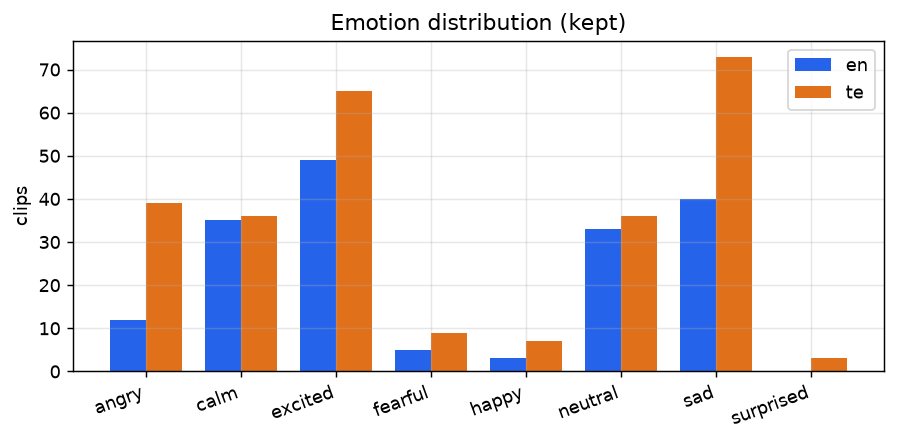

**Schema.** Each row in the published dataset has these fields:

| Column | Description |
|---|---|
| `audio` | 24 kHz mono waveform |
| `text` | raw Sarvam transcript |
| `normalized_text` | TTS-facing text (numbers and abbreviations expanded) |
| `language`, `language_code` | `en` / `te`, `en-IN` / `te-IN` |
| `emotion`, `style` | emotion label (8-class) and speaking style (narrative, conversational, formal, expressive) |
| `emotion_confidence`, `tag_source` | tagger confidence 0–1; `auto` or `human` |
| `speaker_id`, `gender`, `accent` | speaker identifier and inferred attributes |
| `duration` | clip length in seconds |
| `dnsmos_ovrl` (+ `sig`, `bak`), `dnsmos_pass` | DNSMOS perceptual quality and the >3.0 gate |
| `snr_db`, `squim_stoi`/`pesq`/`sisdr` | SNR and reference-free quality estimates |
| `mms_align_score`, `overlap_flag` | forced-alignment confidence; possible second voice |
| `topic`, `llm_tts_suitable` | topic category; validator suitability 0–1 |
| `annotation_flags` (+ booleans) | `quality_flag`, `has_truncation`, `has_codemix`, `transcript_review_needed`, … |
| `source_video_id`, `source_url`, `source_channel`, `license` | provenance |
| `segment_start`, `segment_end`, `sample_rate` | source timing and sample rate |

A real row (`en_mahabharata_0025`):

| Field | Value |
|---|---|
| `text` | "If you ever break your promise, I'll leave you at once." |
| `emotion` / `style` | sad / narrative |
| `emotion_confidence` | 0.85 |
| `speaker_id` / `gender` / `accent` | en_mahabharata / female / Indian English |
| `duration` | 4.29 s |
| `dnsmos_ovrl` / `snr_db` / `mms_align_score` | 3.49 / 46.5 dB / 0.97 |
| `topic` | fiction |

## 2. Iterations to improve data quality

I made the following changes after reviewing intermediate pipeline outputs.

1. **Clipping gate rejected clean audio.** The first Telugu audiobook lost 41 of 43 clips to a
   "clipping" gate even though the audio was fine. The clips peaked at exactly 1.0 because YouTube
   masters loud, and my gate had treated any sample at full scale as clipping. Actual clipping shows
   up as runs of flat-topped samples, so I changed the gate to measure the fraction of flat-topped
   samples instead. That recovered 43 of 43 clips.
2. **The LLM copied my prompt template.** Every clip came back "neutral, narrative" with the rationale
   field reading "<=20 words", which was my instruction text. The model was completing the template
   literally instead of reasoning about the clip. I removed the template and described the fields
   instead, and the labels spread out and matched what I could hear.
3. **The reasoning model truncated before answering.** Labels were varied but half had low confidence.
   `sarvam-30b` reasons before answering, and at a 1500-token budget it spent all of it reasoning and
   never wrote the JSON. I raised the budget (billing is by tokens actually used, so a higher ceiling
   costs nothing) and the truncation stopped. Median tag confidence then reached 0.85.
4. **DNSMOS re-curation.** Perceptual quality (DNSMOS) flagged 47% of clips below 3.0, over my
   pre-set one-third threshold. Per-source analysis showed three sources dragging the set down: an
   archival AIR recording (2.31), a hall discourse (2.27), and an English audiobook (2.42) whose
   compression DNSMOS heard even though its SNR looked clean. I dropped all three and added a clean
   lecture and more narration. Pool pass rate rose from 53 to 63 percent.
5. **Topic focus.** The sources were mostly storytelling, so I made that the dataset's theme rather
   than a random mix, using LLM topic tags to prefer narrative clips in selection.

## 3. What worked and what did not

Worked:

- Audiobook and storytelling sources gave the best mix of clean audio and emotional range.
- The double-pass ASR produced clip-accurate transcripts. English cross-checks at 5.8% word error
  against an independent recognizer.
- DNSMOS exposed bad sources that SNR alone missed (the compressed audiobook), and per-source numbers
  let me drop those specific sources instead of cutting across the board.
- ECAPA speaker verification confirmed single-speaker integrity (AUC 0.96).
- MMS forced alignment provides a transcript check that holds up in Telugu. Switching the second
  recognizer to an Indic, Telugu-specialized model roughly halved the Telugu cross-ASR word error
  versus generic Whisper (76 percent down to 47 percent).

Did not work or needed care:

- Emotion labels are weakly supervised. Off-the-shelf SER models cluster toward neutral and do not
  transfer to Telugu, and the larger model endorses 26 percent of the smaller model's labels on
  acoustic grounds. The labels ship with confidences and are best used as an expressive-TTS filter
  that a human can refine, not as ground truth.
- pyannote overlap detection is behind a license that cannot be accepted from a script, so I used an
  intra-clip embedding-cohesion check instead.
- Telugu cross-ASR stays inconclusive even with the Indic recognizer: it still disagrees with Sarvam
  at 47 percent word error, since two independent Telugu systems diverge heavily on spelling and word
  splits. For Telugu I trust forced alignment and the listening pass more than cross-ASR.
- Clean studio-grade Indian English is scarce on YouTube. The cleanest English clips are off-topic
  (a lecture, a talk), which forced a trade-off described in section 4.

## 4. Quality observations and decisions

Each observation below is backed by a measurement, and where it helps I point to a specific clip you
can pull up in the dataset to check it.

**Evaluation methodology.** Every number in this report comes from a script in `scripts/`, run over the
published clips, with the output saved as JSON under `data/manifests/`. Speaker verification embeds
each clip with an ECAPA-TDNN model (SpeechBrain) and scores 10,000 balanced pairs (5,000 same-speaker,
5,000 different-speaker) by cosine similarity; the ROC-AUC and equal-error rate come from those scores
(`eval_speaker_eer.py`). Perceptual quality is Microsoft DNSMOS run per clip, with SQUIM for
STOI/PESQ/SI-SDR (`score_audio_quality.py`). Alignment confidence is the mean per-frame probability
from the torchaudio MMS forced aligner (`score_mms_align.py`). Cross-ASR word error is computed with
`jiwer` against an independent recognizer (`eval_asr.py`, `eval_asr_indic.py`). Emotion reliability
compares the 30b tags against an independent 105b re-labelling on a 120-clip stride sample (60 per
language), reporting percent agreement, Cohen's κ, and Krippendorff α (`eval_emotion.py`,
`eval_agreement.py`). Phoneme coverage uses grapheme-to-phoneme conversion (g2p_en for English ARPAbet,
epitran for Telugu IPA) over the normalized transcripts, and lexical diversity (type-token ratio, Zipf)
is computed over the same text (`eval_phoneme.py`, `phoneme_freq.py`).

**Single-speaker.** I embedded every clip with ECAPA-TDNN and compared the embeddings by cosine
similarity. Same-speaker pairs score 0.74 on average and different-speaker pairs 0.21. Treated as a
verification task over 10,000 pairs, that separation gives an AUC of 0.96 and a 9 percent equal-error
rate, so clips from one speaker do not bleed into another's.

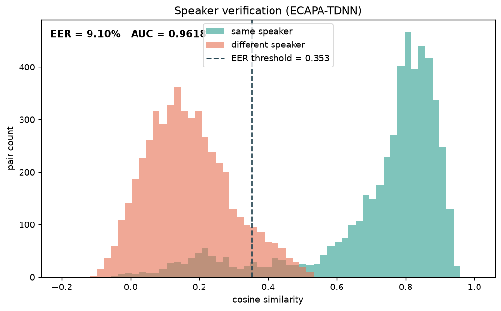

**Transcripts.** For English, an independent recognizer (Whisper small.en) agrees with the Sarvam
transcripts at 5.8 percent word error, and the realtime recognizer identified the correct language on
100 percent of clips. For Telugu I used an Indic recognizer rather than generic Whisper: a
Telugu-specialized Whisper fine-tune (vasista22) brings the word error against Sarvam to 47 percent
(median 50), down from 76 percent with generic Whisper-large. That is still high: two independent
Telugu ASR systems disagree heavily on a morphologically rich, sandhi-heavy script. So for Telugu I
weight MMS forced alignment (median 0.94 confidence, English 0.95) and the human listening pass above
cross-ASR. I report word error rather than character error throughout, since it is the stricter test of
whether the words are right.

The second ASR pass is what catches the worst transcript errors. On `en_mahabharata_e67_0019`, for
example, the coarse batch pass produced "Karna about to creeper", and the per-clip pass corrected it
to "turned about Kripa". Most clips need no correction: `en_mahabharata_0025` transcribes cleanly as
"If you ever break your promise, I'll leave you at once." The full set of edge cases and their
resolutions is in section 5.

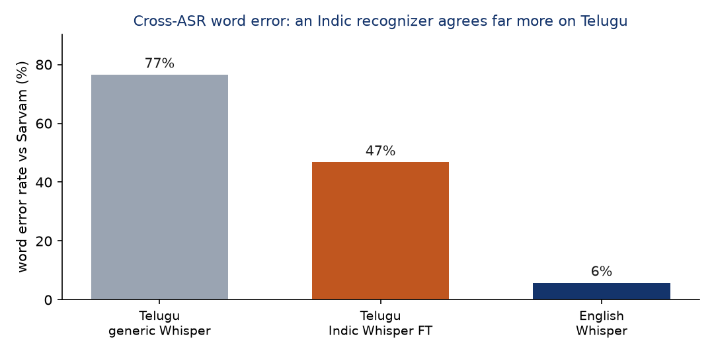

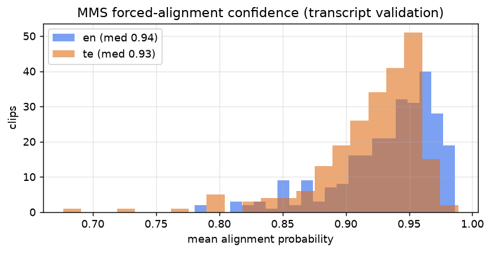

**Emotion.** The emotion labels are best read as weakly supervised annotations, intended for filtering
expressive TTS data, rather than as ground-truth emotion. I measured their reliability instead of
assuming it. On a 120-clip sample (60 per language), the smaller tagging model (`sarvam-30b`) and the
larger validation model (`sarvam-105b`) gave the same label 65 percent of the time, with Cohen's κ
0.55 and Krippendorff α 0.44 between them, which is moderate agreement. Most of the disagreements fall
on adjacent classes such as calm versus neutral. Two acoustic speech-emotion models (emotion2vec,
audeering) drop the three-rater Krippendorff α to about 0.01, because they collapse toward neutral and
were not trained for Telugu. In a separate pass where the larger model judges whether the acoustics
support the 30b label, it endorses 26 percent of them. Because the labels are weakly supervised, each
one ships with a confidence and a source field. Low-confidence clips are flagged
(`emotion_low_confidence`), and a user can keep only the high-confidence or only the expressive clips
by filtering on those fields. For instance `en_mahabharata_0040` ("The angry king said, I don't care
for my promise") is tagged angry at 0.95 confidence, while `te_ramaaraavi_0040` is tagged angry at only
0.40 and would be removed by a confidence threshold. Laughter, where it occurs, is recorded as an
emotion (usually happy or excited) rather than as a separate flag.

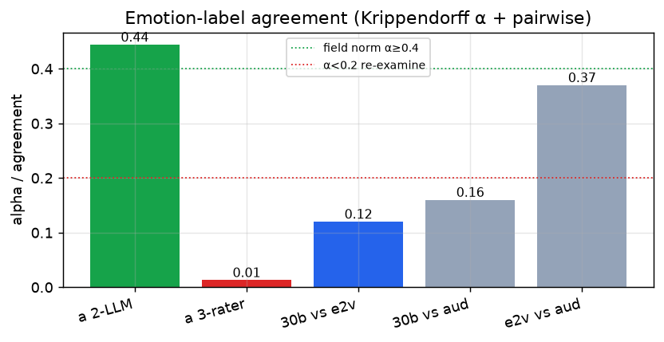

**Overlap.** pyannote is gated, so I embedded short windows within each clip and checked that they all
match the same speaker. Median cohesion is 0.58, the single-speaker level, and only 9 clips fall
below 0.40 and are flagged for a listen.

**Perceptual quality and the topic trade-off.** DNSMOS scores how clean audio sounds. Selecting for
the storytelling topic, the published set is 57 percent above 3.0 in English and 81 percent in
Telugu. English is lower because its cleanest clips are a lecture and a talk, which are off-topic, so
preferring storytelling pulls in narration at DNSMOS 2.85 to 3.19. I chose topic consistency over
marginal gains in perceptual quality, since the set is more useful as a focused storytelling corpus,
and the `dnsmos_pass` column still recovers the cleanest subset with one filter. These clips sit at 23
to 35 dB SNR and the validator rated them around 0.90 suitable, so the lower DNSMOS comes from how the
audio was recorded and mastered, not from added noise. One example is `en_mahabharata_e67_0035` ("Right. No other human being can
defeat Karna."), at DNSMOS 2.94, 23 dB SNR, and 0.90 suitability.

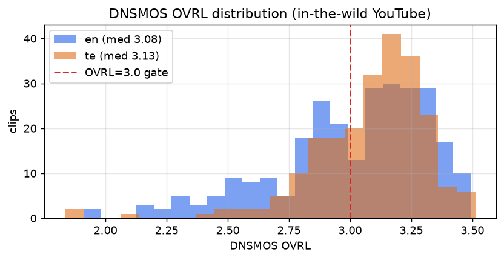

**Per-source quality.** Emotion entropy measures how varied a source's emotions are (higher is more
varied).

| Source | Type | Clips | Min | Median SNR | Median DNSMOS | Emotion entropy |
|---|---|---|---|---|---|---|
| en_nptel | lecture | 53 | 6.9 | 35.7 | 3.23 | 2.36 |
| en_mahabharata | story | 50 | 8.5 | 35.4 | 3.19 | 2.60 |
| en_air_talk | talk | 44 | 9.9 | 28.6 | 3.02 | 2.24 |
| en_tedx_amina | talk | 46 | 9.2 | 43.9 | 2.97 | 2.03 |
| en_mahabharata_e69 | story | 40 | 8.1 | 24.0 | 2.88 | 2.52 |
| en_mahabharata_e67 | story | 40 | 8.1 | 22.9 | 2.85 | 2.39 |
| te_ramaaraavi | story | 47 | 8.6 | 44.9 | 3.23 | 2.34 |
| te_kalalavelugu | audiobook | 50 | 9.4 | 30.6 | 3.20 | 2.60 |
| te_kathalu_epic | story | 39 | 8.8 | 39.9 | 3.16 | 2.52 |
| te_motivation_kasyap | talk | 47 | 7.9 | 38.6 | 3.01 | 2.31 |
| te_bhumiputri | audiobook | 43 | 10.0 | 27.5 | 2.95 | 2.53 |

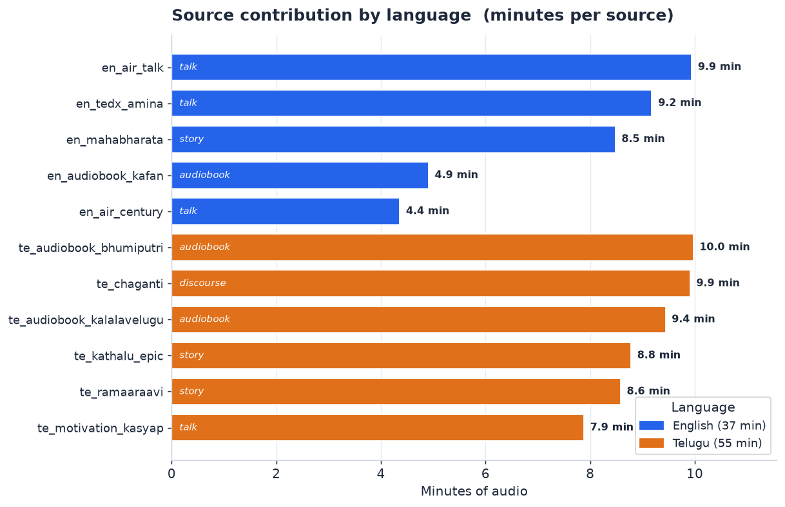

**Selection funnel.** After the per-clip gates, the kept pool was 499 clips (273 English, 226 Telugu).
The published release is 310 of those (160 English, 150 Telugu), chosen to reach about 30 minutes per
language while keeping the emotion histogram balanced. The other 189 passed every check but were
balanced out: once a language hit its 30-minute target, surplus clips from the over-represented buckets
(mostly neutral and calm) were dropped rather than let one emotion dominate. Few clips were rejected at
the gate stage itself, because the bad recordings had already been removed earlier, at source curation
and the DNSMOS step; the gates are the last line of defence, not the first. Concrete error and
edge-case examples are in section 5.

**Other decisions.** I used light loudness normalization instead of a hard target, so the intensity
dynamics that carry emotion survive. Human edits always override automated labels. Gender is inferred
from median F0 with known speakers corrected by hand. The full 60 minutes is kept rather than applying
a hard DNSMOS cut, with `dnsmos_pass` exposing the studio-grade subset.

## 5. Edge cases and annotation decisions

Real speech is messier than a scripted studio read, so most clips carry some imperfection. Every clip
carries an `annotation_flags` string and matching boolean fields that record what is imperfect, and
users filter on them.

**Flag definitions.**
- `quality_flag`: an automatically inferred audio-quality concern, not a verified audible-noise label (set when DNSMOS OVRL is under 3.0, or SNR under 18 dB, or there is elevated energy in the pauses). I named it `quality_flag`, not `has_noise`, because it does not assert that the clip contains audible noise.
- `low_quality_audio`: the stricter automated quality proxy, DNSMOS OVRL under 2.8 (clearly degraded).
- `has_truncation`: the transcript does not end on terminal punctuation, so the clip likely ends mid-utterance.
- `has_codemix`: the regional-language clip contains preserved English words (see the convention below).
- `emotion_low_confidence`: the emotion tag's own confidence is below 0.55.
- `transcript_review_needed`: the LLM judge flagged the transcript, or MMS alignment is below 0.85.
- `overlap_flag`: intra-clip speaker cohesion is low, a possible second voice.

**Statistics (published set).**

| Flag | English (of 160) | Telugu (of 150) |
|---|---|---|
| quality_flag | 68 | 28 |
| has_truncation | 11 | 31 |
| transcript_review_needed | 17 | 46 |
| low_quality_audio | 36 | 10 |
| overlap_flag | 3 | 4 |
| emotion_low_confidence | 0 | 2 |
| has_codemix | 0 | 0 |

**Conventions.**

Laughter is treated as an emotion rather than its own flag. When a clip is audibly laughing, it gets
labelled by the emotion behind it, usually happy or excited. The narration sources here do not contain
laughter, so in practice this never comes up. Other non-verbal sounds (noise, cough, breath, a long
pause) can be marked inline with tags like `<cough>` when they are clearly audible, but those come from
a listening pass and are not in the auto-generated transcripts yet.

When a clip is cut off mid-sentence, I mark it in `annotated_text` with a trailing em dash, as in
"...does it have to do with —", while leaving the raw `text` field clean for training.

Code-mixing would normally be handled by keeping the English word in Latin script and bracketing it,
for example "aa [project] inka [complete] kaaledu". In this dataset it never triggers. Sarvam's ASR
transliterates English into Telugu script, so an English word like "project" comes back written in
Telugu characters, and the detector that looks for Latin-script runs finds none. `has_codemix` is
therefore zero across all 150 Telugu clips. The handling is in place, but there is no code-mixing left
in the text to annotate; catching genuine code-switches would need an ASR pass built for code-mixed
speech, which I have left for future work.

**Edge-case audit (real examples).**

| Clip | Issue | Original | Final | Resolution |
|---|---|---|---|---|
| en_mahabharata_e67_0019 | ASR garbled a name | "Karna about to creeper" | "turned about Kripa" | per-clip realtime re-ASR fixed it |
| AIR talk (ax7l6qOqgpQ) | clip ends mid-utterance | "...does it have to do with" | "...does it have to do with —" | has_truncation=true, em dash in annotated_text |
| en_air_talk_0024 | emotion ambiguous | 30b: sad | 105b: neutral | advisory; emotion confidence plus flag, kept |
| en_mahabharata_0004 | emotion ambiguous (nearby) | 30b: happy | 105b: excited | advisory; both plausible, kept |
| en_mahabharata_e67 clips | DNSMOS 2.85 to 2.9, mild | (kept) | (kept) | quality_flag=true, recoverable via dnsmos_pass filter |

**Curation decisions.** I kept clips with minor issues and annotated them explicitly rather than
removing them. Noisy English storytelling clips (DNSMOS just under 3.0) stayed because they carry the
storytelling voice and emotion the dataset is built around, and `quality_flag` / `dnsmos_pass` let a
user exclude them. I removed three whole sources that DNSMOS exposed as perceptually poor (2.3 to 2.4),
because no per-clip flag rescues a bad recording. I let topic coherence outweigh DNSMOS on the English
side, accepting a lower clean-rate for a coherent storytelling corpus; a user who disagrees can use the
flags to rebuild a cleaner or different subset without touching the audio. The flags also cluster
usefully. `transcript_review_needed` is higher in Telugu (46 vs 17), consistent with Telugu being the
harder ASR target, and the AIR talk source accounts for most truncated and emotion-ambiguous English
clips, which is why it contributes few clips to the final set.

## 6. TTS readiness analysis

**Phoneme coverage.** Coverage is estimated by grapheme-to-phoneme conversion over the normalized
transcripts (g2p_en into ARPAbet for English, epitran into IPA for Telugu), counting the unique
phonemes that appear against each language's inventory. English covers all 39 ARPAbet phonemes (100
percent); Telugu covers 44 of roughly 50 (about 88 percent). The thinnest Telugu phonemes are the aspirated and
breathy-voiced consonants: the retroflex aspirate and breathy-g appear once each, the palatal aspirate
twice, and aspirated dental, k, and p between 10 and 13 times each. These are marginal phones,
entering Telugu mainly through Sanskrit and loanwords. They are under-represented in any natural corpus
this size, so a model trained here will see them rarely. In English the rarest are ZH (0.03 percent)
and OY (0.09 percent), as expected.

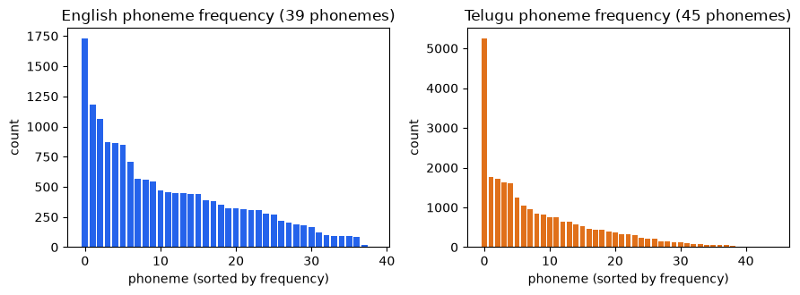

**Duration.** Clips run 3.1 to 24.5 seconds in English (median 11.6) and 3.1 to 22.8 in Telugu
(median 13.1). Durations spread across the range, with no pile-up at the 3-second floor or the
25-second ceiling.

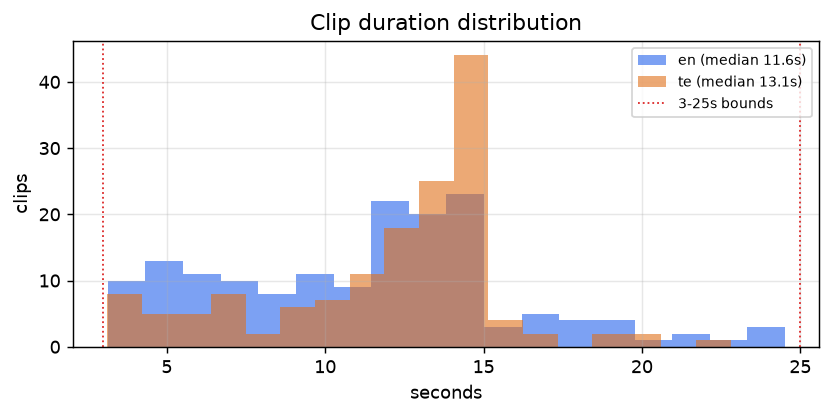

**Transcript length.** Median 27 words per clip in English and 26 in Telugu, a comfortable single
utterance length.

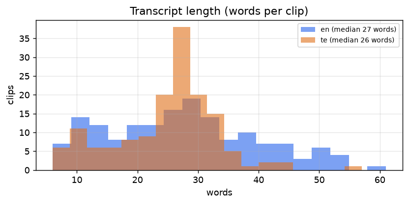

**Speech rate.** English centers on 144 words per minute (6 percent slow, 65 percent medium, 29
percent fast); Telugu on 122 (18 percent slow, 80 percent medium, 2 percent fast). A spread of speech
rates across the set helps a model generalize across tempos.

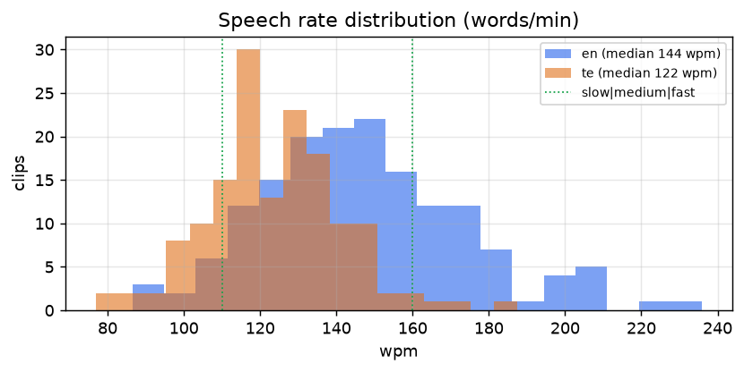

**Lexical diversity.** English has 1,193 unique words over 30 minutes (type-token ratio 0.27), Telugu
1,947 (0.52, higher because Telugu inflects heavily). The word-frequency curve follows the expected
Zipf shape, which indicates natural running text with the usual head of common function words,
not a small set of repeated lines.

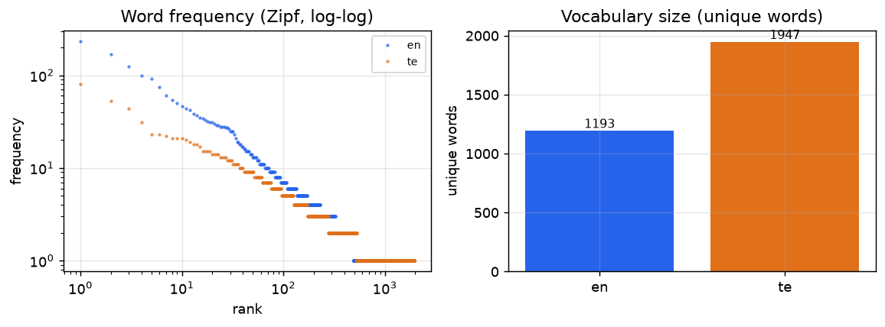

**Text normalization.** The `normalized_text` field is the TTS-facing reading of each transcript:
language-aware expansion of numbers, ordinals, currency, and a conservative set of abbreviations into
spoken words, so a model trains on "sixteenth day" and "doctor" instead of "16th" and "Dr.".
Numbers run through num2words in the clip's own language, so "15" becomes "పదునయిదు" in Telugu, with a
safe fallback to the digits if a value is unsupported. Most of the corpus is narrative, so this only
edits the handful of clips that carry numerals. The abbreviation and currency rules are there for
robustness rather than because the content needs them often. The raw `text` field is kept verbatim
alongside it for reference.

**How this compares to a typical TTS corpus.** Here is how the set lines up against typical TTS
training data, without singling out any one corpus.

| Property | Common practice | This dataset |
|---|---|---|
| Sample rate | 22.05 to 24 kHz mono | 24 kHz mono |
| Total size | tens of hours per voice for production work, an hour or two for a prototype | about 60 minutes total |
| Speakers | often one voice with many hours, or many voices with little each | 9 voices, roughly 4 to 7 minutes each |
| Clip length | usually 1 to 15 seconds | 3 to 25 seconds, median about 12 |
| Transcripts | typically hand-typed or hand-corrected | Sarvam ASR, cross-checked and spot-audited by ear |
| Speaking style | often neutral read speech | expressive narration with emotion tags |
| Loudness | sometimes normalized hard | light normalization, dynamics kept |
| Provenance and splits | varies | per-clip source and license, train/validation/test splits |

On the things a modern TTS pipeline expects, the set is in line: the sample rate, file format, the
train/validation/test splits, and the per-clip provenance all match common practice, and the emotion
coverage is wider than the neutral read speech many corpora ship with. Where it differs is size and
shape. An hour of audio is prototype scale, not production scale, and spreading it over nine voices
leaves only a few minutes per speaker, so this is better suited to multi-speaker or fine-tuning
experiments than to training a single high-fidelity voice. The transcripts are ASR-derived rather than
hand-typed, which is the reason so much of this report is spent checking them.

## 7. Dataset analysis

Beyond the per-clip checks in section 4, I ran six dataset-level analyses to see how the data is
distributed and where its limits are (`scripts/analyze_dataset.py`, `eval_emotion.py`).

**Split integrity.** The train/validation/test split is stratified by emotion and speaker. No clip
appears in more than one split, no transcript is duplicated across splits, and every speaker in
validation and test is also present in training, so there is no leakage and the held-out sets follow
the training distribution. The emotion histogram is preserved in each split. Split sizes are 144/8/8
for English and 134/8/8 for Telugu.

**Per-speaker distribution and quality.** The nine voices are far from evenly sized. On the English
side one narrator, `en_mahabharata`, supplies 23.9 of the 30.2 English minutes (about 79 percent),
while the other three English voices contribute 1.6 to 2.5 minutes each. Telugu is more balanced,
spread across five speakers of 1.9 to 7.5 minutes. The practical consequence is that the English half
behaves close to a single-speaker set, which is worth knowing before training a multi-speaker model.

| Speaker | Lang | Gender | Clips | Minutes | Median DNSMOS |
|---|---|---|---|---|---|
| en_mahabharata | en | F | 122 | 23.9 | 2.95 |
| en_nptel | en | M | 20 | 2.5 | 3.34 |
| en_air_talk | en | F | 10 | 2.2 | 3.17 |
| en_tedx_amina | en | F | 8 | 1.6 | 3.29 |
| te_ramaaraavi | te | F | 41 | 7.5 | 3.24 |
| te_audiobook_kalalavelugu | te | F | 41 | 7.5 | 3.22 |
| te_kathalu_epic | te | M | 30 | 6.8 | 3.16 |
| te_audiobook_bhumiputri | te | F | 27 | 6.3 | 2.97 |
| te_motivation_kasyap | te | M | 11 | 1.9 | 3.04 |

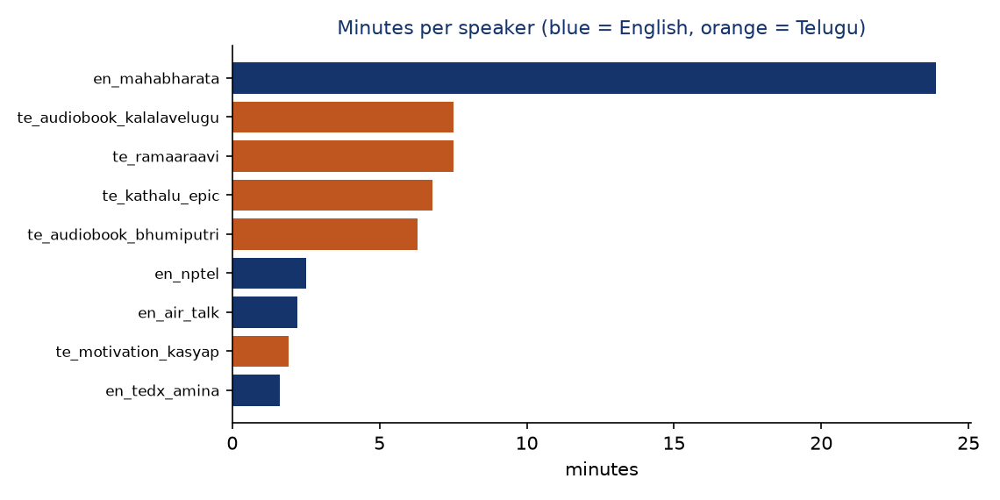

**Emotion agreement and confusion.** The two LLM raters agree on the label for 65 percent of the
120-clip sample (Cohen's κ 0.55). The confusion is structured rather than random: `calm` is the least
stable label, scattering to `sad` (8 clips) and `neutral` (6), and every `happy` clip was relabelled
`excited`. The strong diagonals are `sad` and `excited`. This is the adjacent-class confusion noted in
section 4, now visible pair by pair.

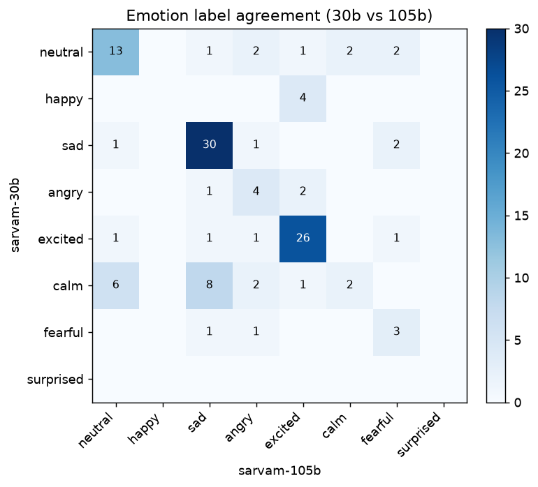

**Valence-arousal consistency.** Even where the categorical labels disagree, the acoustic
valence-arousal estimates line up with them in the expected direction. Positive labels (happy,
surprised, calm) sit at higher valence than negative ones (sad, angry, fearful), and high-arousal
labels (angry, excited, fearful) sit above the low-arousal ones (calm, sad, neutral). The labels are
therefore at least consistent with the prosody, which is what justifies using them as a weakly
supervised filter.

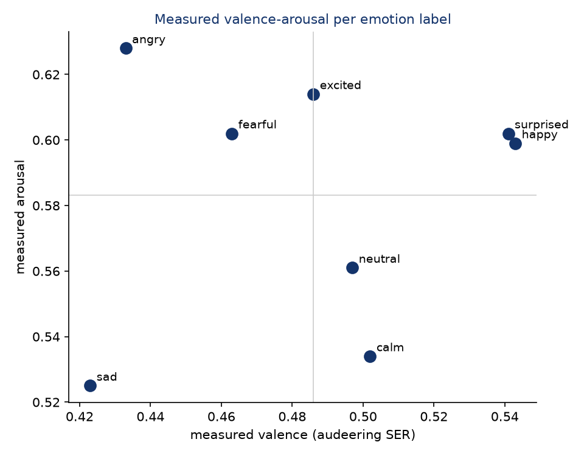

**Audio bandwidth and spectral quality.** This one is a genuine limitation. Although every clip is
stored at 24 kHz, the audio is effectively band-limited: 99 percent of the energy sits below about
4 kHz in English and 2.6 kHz in Telugu, and only 0.1 to 0.2 percent of the energy is above 8 kHz. Some
of that is speech's natural low-frequency dominance, but the near-absence of high-frequency content
points to YouTube's lossy encoding low-passing the sources. The set is well suited to standard 16 to
24 kHz TTS, but not to full-band, high-fidelity synthesis where crisp sibilance matters.

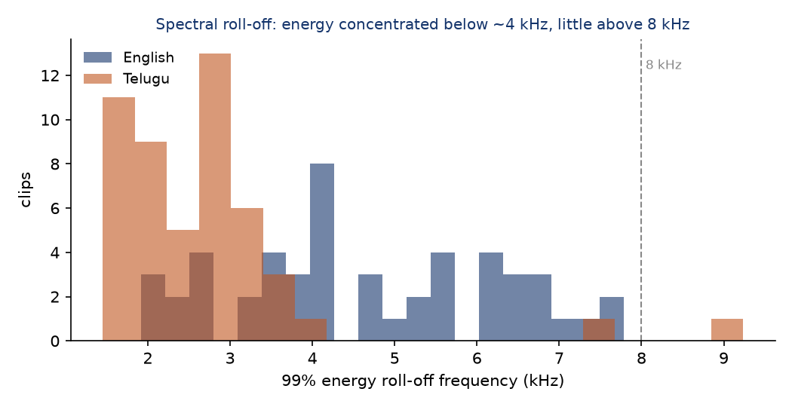

**SNR versus perceptual quality.** SNR and DNSMOS are only moderately correlated (Pearson r = 0.52),
which is why I kept both. A clip can have a clean noise floor (high SNR) yet a low DNSMOS because of
codec or mastering artifacts the SNR estimate cannot see; the compressed English audiobook from
section 2 was exactly that case.

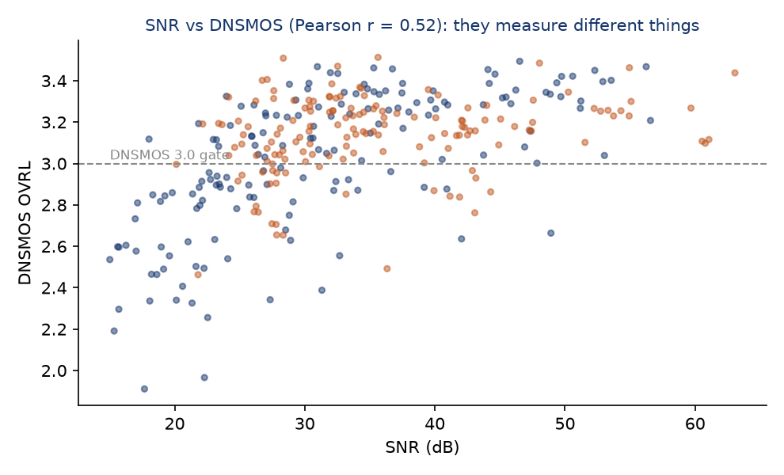

## 8. Human quality audit

I checked quality two ways: automated validation, and a manual listening audit of the clips by ear.

The automatic layer is the larger model (`sarvam-105b`) reading each clip's transcript and acoustic
summary, with no access to the audio. Across the 310 published clips it judged 89 percent of
transcripts clean and 81 percent suitable to train on, and supported the smaller model's emotion label
on 26 percent. This checks the labels; it does not replace listening to the audio.

The human layer is the listening audit, which the automated raters cannot do. I built the harness
(`scripts/human_audit.py sample` writes a scoring sheet and an `audit.html` player; `score` tallies
it) and ran both passes by hand: 40 English and 40 Telugu clips, drawn by stratified random sampling
across all speakers and source types, listening to each and comparing the voice against the transcript.

| Metric | English (n = 40) | Telugu (n = 40) |
|---|---|---|
| Exact transcript match | 37 (92.5%) | 35 (87.5%) |
| Minor error (pronunciation differences) | 3 (7.5%) | 5 (12.5%) |
| Major error | 0 | 0 |
| Audio perceived clean | 31 (77.5%) | 32 (80.0%) |
| Minor background noise | 9 (22.5%) | 8 (20.0%) |
| Judged unsuitable for TTS | 0 | 0 |

Transcripts held up well in both languages: 37 of 40 English and 35 of 40 Telugu matched the audio
exactly, the rest differed only in minor pronunciation, and there were no major transcription errors
on either side. On audio, minor background noise showed up in 9 English and 8 Telugu clips, but the
speaker stayed clearly intelligible in every case and not one clip was judged unusable for TTS. The
human noise rate is about a fifth of clips in each language. In English that sits well below the
automatic `quality_flag` rate (~43 percent); in Telugu it is comparable (~19 percent). That fits how
the flag is meant to work: it is a conservative, over-inclusive proxy a consumer can filter on, and a
flag firing does not mean the clip is bad.

## 9. What I would improve given more time

- A human emotion-labeling pass. The transcript-and-audio listening audit is now done for both
  languages (section 8); emotion is still checked only by the automatic raters, so a human relabeling
  pass would turn that last proxy into ground truth. The review tool supports it.
- A speech-emotion model that handles Telugu, so the third emotion rater is fair.
- Word-level forced-alignment trimming to tighten clip edges further.
- Background-music separation to rescue otherwise-good clips that carry a light bed.
- A cleaner Indian-English storytelling source, the one ingredient that stayed scarce, so the English
  set could reach both topic coherence and high perceptual quality.
